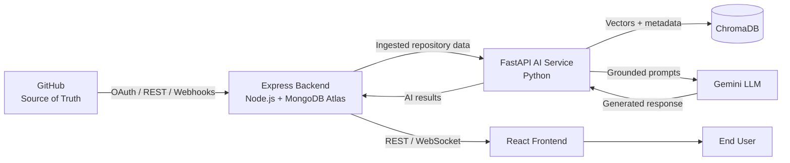
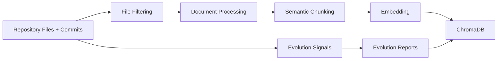
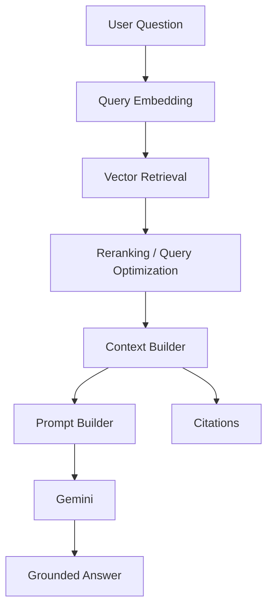
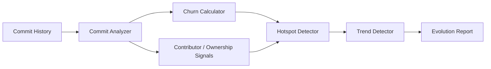
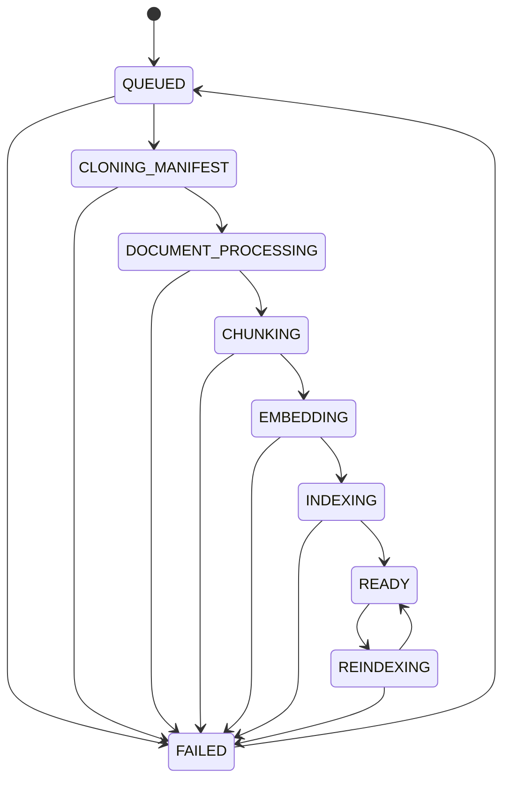

# SEIS — Software Evolution Intelligence System

> **AI-powered intelligence layer for understanding how software repositories are structured, how they evolve, and how engineers can query them using grounded AI.**

SEIS (Software Evolution Intelligence System) analyzes GitHub repositories as **living software systems**. It combines repository structure, source code, documentation, and commit history to produce engineering intelligence such as code hotspots, churn trends, architectural signals, documentation gaps, and grounded repository conversations.

The current architecture separates the **Express business/integration layer** from a dedicated **FastAPI AI microservice**. GitHub remains the source of truth, while the AI service begins processing only after Express has completed repository ingestion.

---

## Table of Contents

- [Overview](#overview)
- [Core Goals](#core-goals)
- [Key Capabilities](#key-capabilities)
- [Architecture](#architecture)
- [AI Service Responsibilities](#ai-service-responsibilities)
- [Processing and Intelligence Pipeline](#processing-and-intelligence-pipeline)
- [Repository Chat and RAG](#repository-chat-and-rag)
- [Software Evolution Analysis](#software-evolution-analysis)
- [Repository Processing Lifecycle](#repository-processing-lifecycle)
- [Project Structure](#project-structure)
- [Technology Stack](#technology-stack)
- [API Contract](#api-contract)
- [Getting Started](#getting-started)
- [Environment Configuration](#environment-configuration)
- [Running the Service](#running-the-service)
- [Development Workflow](#development-workflow)
- [Testing and Evaluation](#testing-and-evaluation)
- [Security Principles](#security-principles)
- [Scalability](#scalability)
- [Development Roadmap](#development-roadmap)
- [Project Boundaries](#project-boundaries)
- [Contributing](#contributing)

---

## Overview

Traditional repository tools usually answer questions about the **current state** of a codebase. SEIS is designed to answer both:

1. **What is the repository now?**
2. **How did it get here?**

The system combines repository processing, semantic retrieval, AI generation, and software-evolution analysis into one intelligence platform.

### Example questions SEIS should answer

- What are the most frequently changing files?
- Which files are potential engineering hotspots?
- How has the architecture changed over time?
- Which modules have high churn and high complexity?
- What does this repository's authentication flow do?
- Where is a particular feature implemented?
- Which documentation appears outdated?
- What changed in the payment module recently?
- Who or what areas of the repository drive the most changes?
- Explain this component using evidence from the repository.

The AI layer is designed around a strict grounding principle: answers should be based on retrievable repository evidence rather than unsupported model knowledge.

---

## Core Goals

### 1. Repository Understanding

Convert source code, documentation, configuration, and repository metadata into a searchable knowledge representation.

### 2. Software Evolution Intelligence

Use commit history and code signals to understand how the system changes over time.

### 3. Grounded Repository Chat

Allow developers to ask natural-language questions about a repository and receive answers supported by repository context and citations.

### 4. Engineering Risk Discovery

Identify potential hotspots using signals such as:

**high churn + high complexity → potential engineering hotspot**

### 5. Scalable AI Architecture

Keep repository processing and interactive chat independent so large indexing workloads do not block user-facing requests.

---

## Key Capabilities

| Capability | Description |
|---|---|
| Repository Processing | Processes files and repository metadata after Express ingestion |
| Semantic Chunking | Converts source code and documentation into meaningful chunks |
| Embeddings | Represents chunks as vectors for semantic retrieval |
| Vector Search | Retrieves repository content relevant to a user query |
| RAG | Grounds generated responses in retrieved repository evidence |
| Repository Chat | Conversational interface over a repository |
| Semantic Search | Direct repository search without LLM generation |
| Evolution Analysis | Analyzes commit history and change patterns |
| Hotspot Detection | Combines churn and complexity signals |
| Architecture Intelligence | Extracts structural and dependency-related signals |
| Documentation Intelligence | Detects documentation coverage and potential drift |
| Evaluation | Measures retrieval quality, groundedness, citations, latency, and cost |
| Incremental Reindexing | Supports repository updates without making the last-good index unavailable |

---

# Architecture

SEIS uses a **layered modular-monolith architecture** for the FastAPI AI service. It is one deployable service internally separated into API, service, core, infrastructure, domain, and evaluation layers.

The architecture is intentionally designed so individual modules can be extracted into separate services later if scale requires it.



### Architectural principle

**GitHub → Express → FastAPI AI → Express → React**

The AI service does **not** directly access GitHub.

This keeps GitHub credentials and user identity outside the AI layer. Express owns GitHub integration, authentication, workspace/project logic, and business data, while FastAPI owns AI processing and intelligence.

---

# AI Service Responsibilities

The FastAPI service owns:

- Repository processing
- Document processing
- Semantic chunking
- Embedding
- Vector storage
- Semantic retrieval
- RAG context construction
- Prompt construction
- Gemini integration
- Repository chat orchestration
- Semantic search
- Software evolution analysis
- Code intelligence
- Architecture intelligence
- Documentation intelligence
- AI evaluation

Express owns:

- GitHub OAuth
- GitHub REST/API integration
- GitHub webhooks
- User identity
- Workspace/project authorization
- Repository metadata
- MongoDB business records
- Chat session/user association
- User-level rate limiting
- Presentation/API aggregation

React owns the user interface and visualization layer.

---

# Processing and Intelligence Pipeline

SEIS has two major data paths.

## Repository ingestion path



### Processing stages

1. **File filtering**
   - Skip binaries
   - Skip generated files
   - Skip vendored dependencies
   - Skip unsupported or oversized files

2. **Document processing**
   - Detect content type
   - Normalize repository content
   - Extract metadata

3. **Semantic chunking**
   - Code-aware chunks
   - Function/class boundaries where supported
   - Heading-aware Markdown chunks
   - Key-aware configuration chunks

4. **Embedding**
   - Convert chunks into vectors
   - Batch embedding operations
   - Cache embeddings using content hashes

5. **Vector indexing**
   - Store vectors and metadata in ChromaDB
   - Maintain repository isolation
   - Track commit SHA and embedding version

6. **Evolution analysis**
   - Analyze commit history
   - Calculate churn
   - Detect hotspots
   - Identify trends
   - Generate evolution reports

---

# Repository Chat and RAG

SEIS uses a manual RAG pipeline rather than depending on a large RAG framework.



## Chat flow

1. User sends a repository question.
2. FastAPI verifies that the repository is queryable.
3. The query may be rewritten using the conversation context.
4. Relevant repository chunks are retrieved.
5. Results can be reranked.
6. Relevant chunks are assembled into a token-budgeted context.
7. Citation metadata is preserved.
8. A deterministic prompt is constructed.
9. Gemini generates the response.
10. The response and citations are returned to Express.

### Grounding rule

The model should answer from the provided repository context.

If sufficient evidence cannot be found, the system should communicate that the information was not found rather than inventing an answer.

This is a core design requirement, not merely a prompt preference.

---

# Software Evolution Analysis

SEIS is not only a code-search system. A major purpose is understanding **software evolution**.

The evolution engine processes commit history independently from the normal document-processing pipeline.



## Current intelligence areas

### Churn

Measures how frequently repository files change.

### Complexity

Provides structural signals that can be combined with change frequency.

### Hotspots

A potential hotspot is identified using a combination of:

```text
Hotspot Risk ≈ Change Frequency × Complexity
```

A frequently modified but trivial configuration file is not treated the same as a frequently modified complex module.

### Contributor and ownership signals

The system can identify patterns in who changes particular parts of the repository.

### Trend analysis

Evolution signals are aggregated over time to identify patterns rather than relying only on individual commits.

### Future evolution intelligence

Planned extensions include:

- Predictive risk scoring
- Release-quality forecasting
- Ownership graphs
- Architectural drift detection
- More advanced dependency analysis
- Multi-repository evolution analysis

---

# Repository Processing Lifecycle



| State | Description | Chat/Search |
|---|---|---|
| `QUEUED` | Job accepted | No |
| `CLONING_MANIFEST` | Manifest validation/fetching | No |
| `DOCUMENT_PROCESSING` | Repository content normalization | No |
| `CHUNKING` | Semantic chunk creation | No |
| `EMBEDDING` | Vector generation | No |
| `INDEXING` | ChromaDB indexing | No |
| `READY` | Repository fully queryable | Yes |
| `REINDEXING` | New version being prepared | Yes, using last-good index |
| `FAILED` | Processing failed | No |

Reindexing uses a staging approach so the last working index remains available until the new index is successfully prepared.

---

# Project Structure

```text
fastapi-ai-service/
│
├── app/
│   ├── main.py
│   │
│   ├── config/
│   │   ├── settings.py
│   │   └── logging_config.py
│   │
│   ├── api/
│   │   ├── deps.py
│   │   ├── v1/
│   │   │   ├── ingest_routes.py
│   │   │   ├── chat_routes.py
│   │   │   ├── analysis_routes.py
│   │   │   ├── search_routes.py
│   │   │   └── health_routes.py
│   │   └── schemas/
│   │       ├── ingest_schema.py
│   │       ├── chat_schema.py
│   │       └── analysis_schema.py
│   │
│   ├── services/
│   │   ├── repository_processing_service.py
│   │   ├── evolution_analysis_service.py
│   │   ├── repository_chat_service.py
│   │   ├── semantic_search_service.py
│   │   └── evaluation_service.py
│   │
│   ├── core/
│   │   ├── processing/
│   │   │   ├── document_processor.py
│   │   │   ├── chunker.py
│   │   │   └── metadata_extractor.py
│   │   │
│   │   ├── embedding/
│   │   │   ├── embedder.py
│   │   │   └── embedding_cache.py
│   │   │
│   │   ├── retrieval/
│   │   │   ├── retriever.py
│   │   │   ├── reranker.py
│   │   │   └── query_rewriter.py
│   │   │
│   │   ├── generation/
│   │   │   ├── context_builder.py
│   │   │   ├── prompt_builder.py
│   │   │   └── gemini_gateway.py
│   │   │
│   │   ├── intelligence/
│   │   │   ├── code_intelligence.py
│   │   │   ├── architecture_intelligence.py
│   │   │   └── documentation_intelligence.py
│   │   │
│   │   └── evolution/
│   │       ├── commit_analyzer.py
│   │       ├── churn_calculator.py
│   │       └── trend_detector.py
│   │
│   ├── infra/
│   │   ├── vectorstore/
│   │   │   └── chroma_client.py
│   │   ├── queue/
│   │   │   ├── task_queue.py
│   │   │   └── worker.py
│   │   ├── cache/
│   │   │   └── cache_client.py
│   │   ├── http/
│   │   │   └── express_client.py
│   │   └── llm/
│   │       └── gemini_client.py
│   │
│   ├── domain/
│   │   ├── models.py
│   │   ├── enums.py
│   │   └── exceptions.py
│   │
│   └── evaluation/
│       ├── golden_dataset/
│       ├── metrics.py
│       └── evaluators.py
│
├── tests/
│   ├── unit/
│   ├── integration/
│   └── e2e/
│
├── scripts/
├── docs/
├── Dockerfile
├── requirements.txt
├── pyproject.toml
└── .env.example
```

---

# Technology Stack

| Layer | Technology |
|---|---|
| AI API | FastAPI |
| Language | Python |
| API Server | Uvicorn |
| Validation / Configuration | Pydantic + Pydantic Settings |
| AI Model | Google Gemini |
| Vector Store | ChromaDB |
| Structured Logging | Structlog |
| HTTP Client | HTTPX |
| Retry / Resilience | Tenacity |
| Business Backend | Express / Node.js |
| Structured Data | MongoDB Atlas |
| Source Control | GitHub |
| Frontend | React / Vite |
| UI Styling | Tailwind CSS |
| Data Retrieval | Manual RAG pipeline |

The current foundation requirements pin FastAPI `0.115.6`, Uvicorn `0.34.0`, Pydantic `2.10.4`, Pydantic Settings `2.7.1`, HTTPX `0.28.1`, Structlog `24.4.0`, Tenacity `9.0.0`, and `google-genai 0.3.0`. ChromaDB is intentionally managed separately from the base runtime requirements.

---

# API Contract

The FastAPI service is intended to communicate with Express through internal service-to-service APIs.

| Method | Endpoint | Purpose |
|---|---|---|
| `POST` | `/api/v1/repositories/{id}/ingest` | Start repository processing |
| `GET` | `/api/v1/repositories/{id}/status` | Retrieve processing status |
| `POST` | `/internal/callbacks/processing-complete` | Notify Express of processing result |
| `POST` | `/api/v1/repositories/{id}/chat` | Ask a repository question |
| `POST` | `/api/v1/repositories/{id}/search` | Semantic repository search |
| `GET` | `/api/v1/repositories/{id}/evolution` | Retrieve evolution analysis |
| `POST` | `/api/v1/repositories/{id}/reindex` | Trigger incremental reindex |

Repository ingestion is asynchronous and should return `202 Accepted` with a job identifier. Chat and semantic search are latency-sensitive request/response operations.

---

# Getting Started

## Prerequisites

Recommended foundation environment:

- Python 3.13+
- Git
- Docker
- ChromaDB environment
- Google Gemini API access
- Express backend for full integration

The foundation dependencies were verified against Python 3.13.4.

---

## 1. Clone the repository

```bash
git clone <repository-url>
cd fastapi-ai-service
```

Replace `<repository-url>` with the project's actual Git repository URL.

---

## 2. Create a virtual environment

### Windows

```bash
python -m venv .venv
.venv\Scripts\activate
```

### Linux / macOS

```bash
python3 -m venv .venv
source .venv/bin/activate
```

---

## 3. Install dependencies

```bash
pip install --upgrade pip
pip install -r requirements.txt
```

ChromaDB is intentionally maintained separately from the base runtime dependency file in the current architecture.

---

## 4. Configure environment variables

Create a local `.env` file from `.env.example`.

Example:

```env
SERVICE_ENV=development
SERVICE_PORT=8000

INTERNAL_API_KEY=change-me

GEMINI_API_KEY=your-gemini-api-key
GEMINI_MODEL_NAME=your-pinned-gemini-model
GEMINI_TEMPERATURE=0.2
GEMINI_MAX_OUTPUT_TOKENS=2048
GEMINI_TIMEOUT_MS=30000

EMBEDDING_MODEL_NAME=your-embedding-model
EMBEDDING_MODEL_VERSION=1

CHROMA_HOST=localhost
CHROMA_PORT=8001

LOG_LEVEL=INFO
```

Do **not** commit `.env` or any API keys to Git.

---

# Running the Service

Start the development server with:

```bash
uvicorn app.main:app --reload --host 0.0.0.0 --port 8000
```

The API should then be available at:

```text
http://localhost:8000
```

FastAPI automatically exposes interactive API documentation when the application is configured with the standard OpenAPI setup:

```text
http://localhost:8000/docs
```

---

# Development Workflow

SEIS development is organized around incremental AI capabilities.

### Recommended implementation order

```text
FastAPI Foundation
        ↓
Repository Processing
        ↓
Embedding + ChromaDB
        ↓
Core RAG
        ↓
Repository Chat
        ↓
Semantic Search
        ↓
Evolution Analysis
        ↓
Evaluation + Security
        ↓
Express / React Integration
        ↓
Production Hardening
```

### Important architectural rule

Do not move AI business logic into Express.

Do not move workspace/authentication/business logic into FastAPI.

The service boundary is intentional and should be preserved.

---

# Testing and Evaluation

Testing is divided into three levels.

## Unit Tests

Located in:

```text
tests/unit/
```

Used for framework-independent core components such as:

- Chunking
- Metadata extraction
- Retrieval logic
- Context construction
- Prompt generation
- Churn calculations
- Trend detection

## Integration Tests

Located in:

```text
tests/integration/
```

Used for:

- ChromaDB integration
- Service-layer orchestration
- Gemini gateway behavior
- Repository processing

## End-to-End Tests

Located in:

```text
tests/e2e/
```

Used for full flows such as:

```text
Express
  ↓
FastAPI
  ↓
Repository Processing
  ↓
ChromaDB
  ↓
Repository Chat
  ↓
Gemini
  ↓
Grounded Answer
```

---

# AI Evaluation

SEIS treats evaluation as a first-class part of the AI system.

The evaluation framework should measure:

- Retrieval precision@K
- Retrieval recall@K
- Groundedness / faithfulness
- Citation accuracy
- Answer quality
- Latency
- Token usage
- Cost
- Regression across prompt/model changes

A versioned golden dataset should be maintained for representative repositories.

The evaluation pipeline should run independently of the live chat request path.

---

# Security Principles

Security is part of the architecture rather than an afterthought.

### GitHub credentials stay in Express

FastAPI never receives GitHub OAuth tokens and never calls GitHub directly.

### FastAPI is an internal service

FastAPI should not be publicly exposed. Express communicates with it using a service-to-service credential.

### Repository isolation

Repository identifiers are used as isolation keys for:

- Vector collections
- Cache keys
- Processing state
- Retrieval scope

### Retrieval isolation

Every retrieval operation must be scoped to the requested repository before similarity search.

A cross-repository retrieval leak is treated as a **security vulnerability**, not merely a retrieval-quality issue.

### Secrets

Never commit:

- Gemini API keys
- Internal service credentials
- Database credentials
- Broker credentials
- Production environment files

### Prompt injection

Repository content should be treated as untrusted data. Retrieved code and documentation must not be allowed to override system-level grounding or security instructions.

---

# Scalability

SEIS separates two fundamentally different workloads.

| Workload | Characteristics | Strategy |
|---|---|---|
| Repository Processing | Slow, bursty, CPU/IO heavy | Background jobs + worker pool |
| Chat / Search | Fast, latency-sensitive | Async FastAPI handlers + caching |

This prevents a large repository ingestion job from blocking repository chat.

Additional scalability mechanisms include:

- Batched embedding
- Embedding cache
- Retrieval caching
- Response caching
- Worker horizontal scaling
- Streaming/paginated file processing
- Incremental reindexing
- Debounced webhook processing
- Repository-level isolation
- Circuit breakers
- Exponential backoff
- Dead-letter handling

---

# Error Handling

The service categorizes errors into:

- Transient infrastructure failures
- Rate limits
- Validation failures
- Domain errors
- Partial pipeline failures
- Unknown/catastrophic failures

Transient failures should use bounded retries with exponential backoff and jitter.

Processing jobs must be idempotent so failed work can safely be retried.

A failed job should always produce an explicit processing state and human-readable error reason.

---

# Logging and Observability

SEIS uses structured logging.

Important fields include:

```text
timestamp
level
correlationId
repositoryId
module
event
durationMs
message
```

Logs should not contain proprietary repository content or full prompts at normal log levels.

Correlation IDs should propagate across Express, FastAPI, background workers, and callbacks so individual processing jobs and chat requests can be traced end-to-end.

---

# Project Boundaries

## In Scope

- FastAPI AI microservice
- Repository processing
- Embeddings
- Vector storage
- Retrieval
- RAG
- Repository chat
- Semantic search
- Evolution analysis
- Code intelligence
- Architecture intelligence
- Documentation intelligence
- AI evaluation
- AI security

## Out of Scope for the AI Service

- GitHub OAuth
- GitHub API integration
- User authentication
- MongoDB business CRUD
- Workspace/project management
- React UI
- User-facing authorization logic
- Dashboard presentation

These responsibilities remain with the appropriate application layers.

---

# Development Roadmap

| Phase | Focus | Main Deliverables |
|---|---|---|
| Week 1 | System Design | Architecture, module boundaries, data flow, security model |
| Week 2 | Foundation | FastAPI skeleton, configuration, logging, health endpoint, base CI |
| Week 3 | Repository Processing | Document processor, chunker, embedder, ChromaDB indexing |
| Week 4 | Core RAG | Retriever, context builder, prompt builder, Gemini gateway, baseline chat |
| Week 5 | Chat Hardening | Query rewriting, reranking, caching, semantic search |
| Week 6 | Evolution Analysis | Commit analyzer, churn, hotspots, trends, evolution reports |
| Week 7 | Evaluation & Security | Golden dataset, evaluation pipeline, security hardening |
| Week 8 | Integration & Production | Express/React integration, performance tuning, documentation, demo |

---

# Design Principles

SEIS follows several core engineering principles:

### Grounded over Generative

The system should prefer repository evidence over unsupported generation.

### Explainable over Opaque

Retrieved chunks, file paths, line ranges, and evolution signals should remain traceable.

### Stateless Compute

FastAPI workers should be disposable.

### Durable State

Processing state, vectors, and evolution artifacts belong in persistent storage.

### Repository Isolation

One repository must never leak data into another repository's retrieval context.

### Incremental Evolution

Repository updates should not require unnecessary full reprocessing.

### Modular Architecture

Internal modules should have clear responsibilities and interfaces.

### Evaluate Before Optimizing

Changes to prompts, retrieval, embeddings, or models should be evaluated against measurable quality criteria.

---

# Current Foundation Dependencies

The current AI-service foundation pins the following runtime dependencies:

```text
fastapi==0.115.6
uvicorn[standard]==0.34.0
pydantic==2.10.4
pydantic-settings==2.7.1
httpx==0.28.1
structlog==24.4.0
tenacity==9.0.0
google-genai==0.3.0
```

Additional embedding, vector-store, and processing dependencies are introduced in the corresponding implementation phases rather than being treated as part of the initial foundation.

---

# Contributing

When adding a new AI capability:

1. Define its responsibility and boundary.
2. Keep API concerns inside `api/`.
3. Keep orchestration inside `services/`.
4. Keep reusable AI logic inside `core/`.
5. Keep external integrations inside `infra/`.
6. Add domain models where appropriate.
7. Add unit tests for core logic.
8. Add integration tests for external dependencies.
9. Add evaluation cases for changes affecting retrieval or generation.
10. Update documentation when architecture or API contracts change.

Avoid introducing a new framework or dependency unless it solves a demonstrated problem.

---

## Project Status

**Status:** Active Development

**Current focus:** AI service foundation and implementation of the Software Evolution Intelligence pipeline.

SEIS is being developed as a modular AI system that can evolve from a final-year-project-scale platform into a more comprehensive software engineering intelligence platform.
